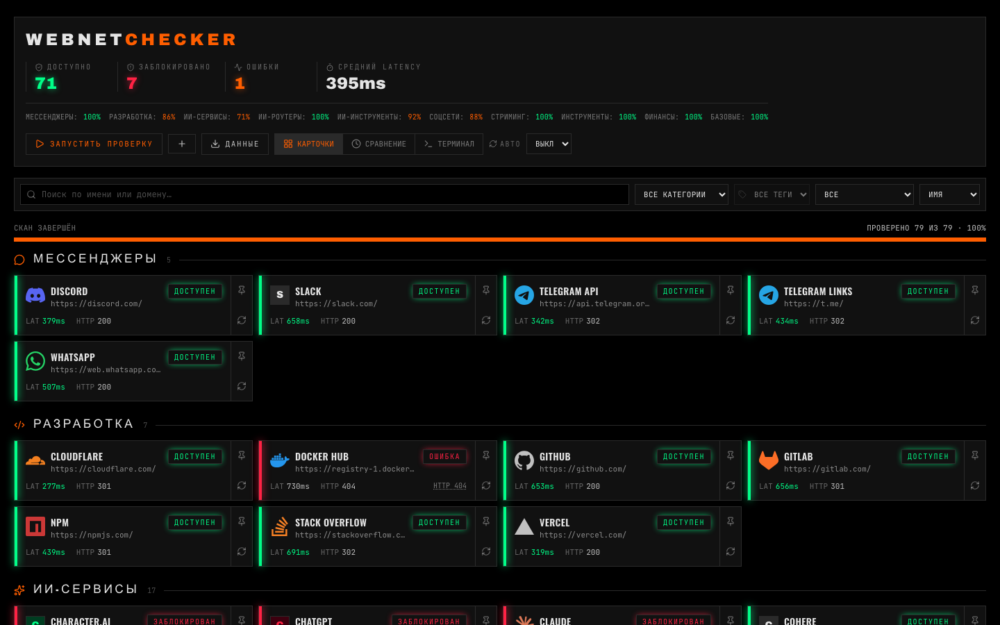
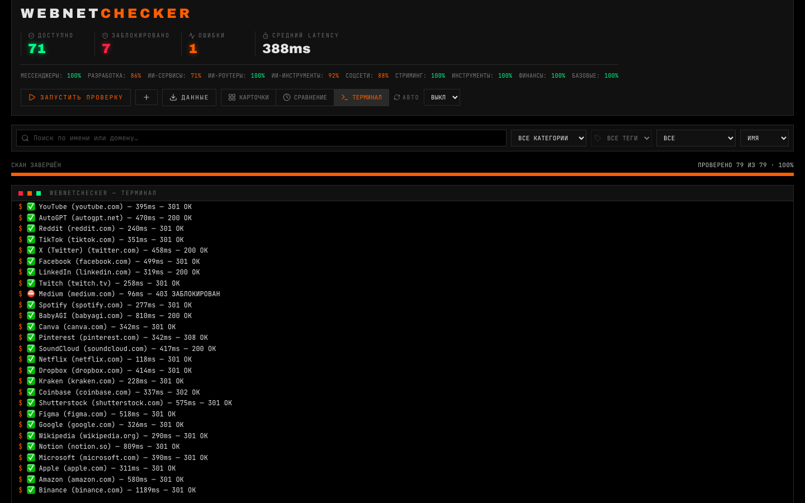
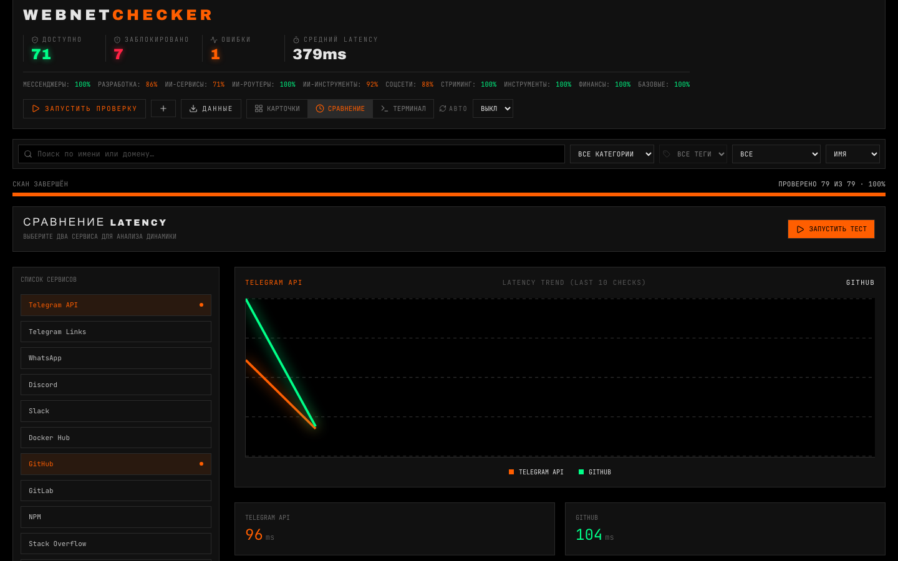
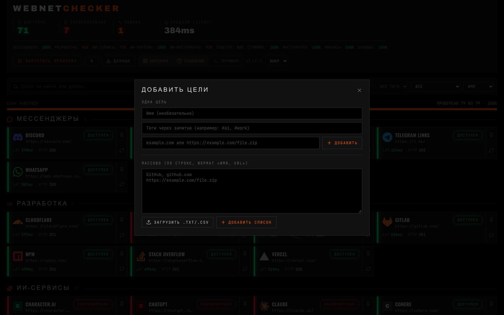
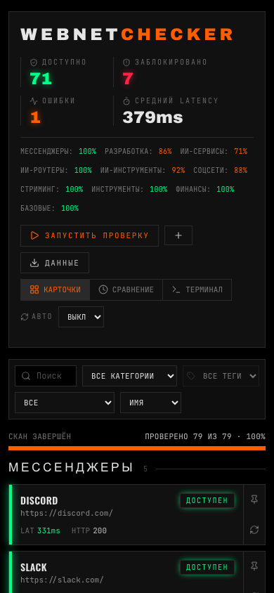

<div align="center">

# WebNet**Checker**

**Дашборд мониторинга доступности доменов, сервисов и файлов.** Вдохновлён bash-скриптом, который параллельно пингует сервисы (Telegram, GitHub, ChatGPT, YouTube…) и выводит вердикт: **ДОСТУПЕН / ЗАБЛОКИРОВАН**.



</div>

**Стек:** Next.js 16.3.8 (App Router) · React 19 · TypeScript strict (`noUncheckedIndexedAccess`) · Tailwind CSS v4 · Zustand 5 · Zod 4 · undici · Vitest + Playwright

---

## Режимы интерфейса

| Карточки                                          | Терминал                                             | Сравнение                                            |
| ------------------------------------------------- | ---------------------------------------------------- | ---------------------------------------------------- |
|  |  |  |

| Диалог добавления целей                            | Мобильный вид                                       |
| -------------------------------------------------- | --------------------------------------------------- |
|  |  |

## Возможности

- **Параллельные HTTP-проверки** — настраиваемый таймаут (по умолчанию 3 с), пул конкурентности (10), ретраи при таймауте.
- **NDJSON-стриминг в реальном времени** — карточки обновляются по мере завершения каждого чека; обрыв соединения корректно останавливает скан на сервере.
- **SSRF-защита уровня DNS** — undici Agent с валидацией каждого разрешённого адреса в момент соединения (закрывает DNS-rebinding), блокировка приватных диапазонов, cloud metadata, localhost. Редиректы не следуются.
- **Двухуровневый rate limiting** — пер-клиент (10/мин) + глобальный резервный бакет (60/мин), который не обойти ротацией `X-Forwarded-For`.
- **Тёмный техно-дашборд** — карточки со статусами и sparkline latency, бренд-логотипы сервисов и иконки категорий (генерируются из [Simple Icons](https://simpleicons.org/) в билд-тайм, без внешних запросов в рантайме; тёмные логотипы осветляются по WCAG-люминанс), терминальный режим, сравнение двух целей, фильтры (категория, тег, статус), поиск, сортировка.
- **Seed-каталог 79 сервисов** в 11 категориях + свои цели: по одной, списком или из `.txt/.csv`, импорт/экспорт JSON/CSV.
- **Изолированные мини-сканы** — «перепроверить» и «сравнить» не прерывают общий скан; автообновление (выкл / 30 с / 1 мин / 5 мин) ждёт завершения текущего скана.
- **История проверок** в localStorage (последние 20 прогонов, скоуп — конкретный скан).
- **Безопасность** — CSP без внешних источников, security headers, same-origin UI-эндпоинт, constant-time сравнение ключа, Zod на всех входах (включая импорт файлов и hydrate).
- **Доступность** — клавиатурная навигация по диалогам и меню (Escape, ловушка фокуса), `prefers-reduced-motion`, ARIA-лейблы, статусы словами, а не только цветом.
- **SEO** — sitemap, robots, Open Graph (статическая OG-картинка на nodejs-рантайме).

## Быстрый старт

```bash
npm install
cp .env.example .env.local   # все значения имеют безопасные дефолты
npm run dev
```

Откройте <http://localhost:3000> и нажмите **«Запустить проверку»**.

> **Доступ по `127.0.0.1` или LAN-IP?** Next 16 блокирует dev-ресурсы (CSS/JS-чанки, HMR) для хостов
> вне `allowedDevOrigins` — страница отрендерится, но не гидратируется: стили пропадут, кнопки не
> будут реагировать. `localhost` разрешён всегда; `127.0.0.1` и подсеть `192.168.1.*` уже добавлены
> в `next.config.ts`. Другой адрес (другая подсеть, hostname) — добавьте туда же и перезапустите dev.

## Команды

| Команда                        | Описание                                                                                |
| ------------------------------ | --------------------------------------------------------------------------------------- |
| `npm run dev`                  | Dev-сервер (Turbopack)                                                                  |
| `npm run dev:restart`          | Перезапуск dev: убивает процесс на :3000 и стартует заново (macOS/Linux)                |
| `npm run dev:clean`            | То же + удаление `.next` (сброс персистентного кэша Turbopack)                          |
| `npm run build` / `npm start`  | Продакшн-сборка и запуск                                                                |
| `npm run typecheck`            | `tsc --noEmit`                                                                          |
| `npm run lint` / `lint:fix`    | ESLint 9 (flat config)                                                                  |
| `npm test`                     | Unit-тесты (Vitest, 73 теста)                                                           |
| `npm run test:e2e`             | E2E (Playwright, chromium)                                                              |
| `npm run format`               | Prettier                                                                                |
| `npm run logos`                | Регенерация бренд-логотипов из simple-icons (`src/lib/config/brand-logos.generated.ts`) |
| `node scripts/screenshots.mjs` | Переснятие скриншотов README (нужен `npm run build`)                                    |

## Dev-troubleshooting: страница рендерится, но кнопки не реагируют

Так выглядит упавшая гидратация: SSR-HTML на месте, а React-обработчики не подключены. Причина
почти всегда видна в DevTools → Network по статусам запросов `/_next/*`:

| Статус `/_next/*`                                                 | Причина                                                                                                                                                                           | Лечение                                                                                            |
| ----------------------------------------------------------------- | --------------------------------------------------------------------------------------------------------------------------------------------------------------------------------- | -------------------------------------------------------------------------------------------------- |
| **403**                                                           | Хост открыт не из `allowedDevOrigins` (по умолчанию Next 16 разрешает только `localhost`). Стилей при этом тоже нет                                                               | Добавьте хост/маску в `allowedDevOrigins` (`next.config.ts`) и перезапустите dev                   |
| **404**                                                           | На :3000 отвечает **старый** dev-процесс: «второй запуск» не стартовал, а `.next` удалён/заменён у старого из-под ног. Стили при этом тоже нет                                    | `npm run dev:restart` (или `kill <PID>` — Next печатает его в сообщении)                           |
| **ERR_SSL_PROTOCOL_ERROR**, URL в консоли начинается с `https://` | CSP-директива `upgrade-insecure-requests` (включена только в проде) заставляет Chrome переписать `http://`-подресурсы на `https://`; `localhost` Chrome исключает, а LAN-IP — нет | Директива не должна включаться в dev (`next.config.ts`) — проверьте, что условие `!isDev` на месте |

Про «второй запуск»: жёсткая остановка (`kill -9`, кнопка Stop в IDE) может оставить
`next-server` живым на :3000. Тогда следующий `npm run dev` печатает
`⚠ Port 3000 is in use… ⨯ Another next dev server is already running` и **завершается** —
новый сервер не запущен, страницу обслуживает старый процесс. Проверка: `lsof -ti tcp:3000`.

Если гидратация ломается при одном гарантированно живом сервере — подозревайте персистентный кэш
Turbopack (включён по умолчанию с Next 16.1): разово помогает `npm run dev:clean`, постоянное
отключение — `experimental.turbopackFileSystemCacheForDev: false` в `next.config.ts` (медленнее
тёплый старт).

## Переменные окружения

| Переменная                     | По умолчанию            | Описание                                                                                                         |
| ------------------------------ | ----------------------- | ---------------------------------------------------------------------------------------------------------------- |
| `CHECK_TIMEOUT_MS`             | `3000`                  | Таймаут одного HTTP-чека (500–30000)                                                                             |
| `SCAN_MAX_TARGETS`             | `200`                   | Максимум целей за один скан (1–1000)                                                                             |
| `SCAN_CONCURRENCY`             | `10`                    | Пул конкурентности (1–32)                                                                                        |
| `RATE_LIMIT_SCANS`             | `10`                    | Сканов в минуту с одного клиента                                                                                 |
| `RATE_LIMIT_WINDOW_MS`         | `60000`                 | Окно rate limit (мс)                                                                                             |
| `RATE_LIMIT_GLOBAL`            | `60`                    | Глобальный резервный бакет (сканов/мин на процесс)                                                               |
| `TRUST_PROXY`                  | `0`                     | `1` — за доверенным прокси (nginx/Vercel): клиент = последний элемент `X-Forwarded-For`                          |
| `CHECK_RETRIES`                | `1`                     | Ретраи при таймауте (0–3)                                                                                        |
| `NEXT_PUBLIC_SITE_URL`         | `http://localhost:3000` | Для metadata / OG / sitemap                                                                                      |
| `NEXT_PUBLIC_SCAN_MAX_TARGETS` | `200`                   | Зеркало `SCAN_MAX_TARGETS` для капов в UI                                                                        |
| `SCAN_API_KEY`                 | _(пусто)_               | Ключ для **внешних** вызовов `POST /api/scan` (`x-scan-key`). Дашборду не нужен — он ходит через `/api/scan/run` |
| `UPSTASH_REDIS_REST_URL/TOKEN` | _(пусто)_               | Задел под распределённый rate limit (Vercel)                                                                     |

## API

| Эндпоинт               | Назначение                                                                                                                     |
| ---------------------- | ------------------------------------------------------------------------------------------------------------------------------ |
| `POST /api/scan`       | Публичный скан (NDJSON-стрим). Для внешних вызовов: cron и скрипты. При заданном `SCAN_API_KEY` требует заголовок `x-scan-key` |
| `POST /api/scan/run`   | Эндпоинт дашборда: только same-origin, ключ подставляется серверно. UI работает при любой конфигурации ключа                   |
| `GET /api/scan/latest` | Кэш последнего скана (только seed-цели; no-store). Кастомные цели между посетителями не утекают                                |

Формат стрима — NDJSON: события `start` → `result`* → `rejected?` → `done`.

## Архитектура ядра

```
src/
├── app/
│   ├── api/
│   │   ├── scan/route.ts          # POST → публичный скан (ключ опционален)
│   │   ├── scan/run/route.ts      # POST → same-origin UI-скан
│   │   └── scan/latest/route.ts   # GET  → кэш последнего скана
│   ├── layout.tsx                 # шрифты, metadata, OG
│   └── page.tsx                   # дашборд (client component)
├── lib/
│   ├── checker/
│   │   ├── scan-handler.ts        # общая логика: лимиты, стрим, кэш
│   │   ├── ssrf-guard.ts          # SSRF: guarded lookup + undici Agent
│   │   ├── fetch-checker.ts       # HEAD→GET фолбэк, ретраи, только заголовки
│   │   ├── classify.ts            # классификация ошибок (DNS/SSL/timeout/…)
│   │   ├── pool.ts                # bounded concurrency (async generator)
│   │   ├── normalize-url.ts       # Zod-схема + нормализация URL
│   │   ├── request-schema.ts      # Zod-схема тела скана
│   │   └── result-schema.ts       # Zod-схема результата (hydrate/импорт)
│   ├── rate-limit.ts              # пер-клиент + глобальный бакеты, TRUST_PROXY
│   ├── cache.ts / scan-cache-instance.ts
│   ├── config/                    # categories, services (79 сидов), env, client-env
│   └── export.ts                  # JSON/CSV/текст + импорт с валидацией
├── store/scan-store.ts            # zustand: цели, результаты, фильтры, режимы
├── hooks/                         # useScan (main/isolated), useFilters,
│                                  # useAutoRefresh, useHistory
└── components/                    # ServiceCard, TerminalView, ComparisonView,
                                   # BrandLogo, FilterBar, Toolbar, ExportMenu, AddTargetDialog…
```

## Безопасность

- **SSRF**: валидация IP внутри connection-time DNS-lookup — резолв и проверка атомарны, DNS-rebinding не проходит; fail-closed на непарсируемых адресах; протоколы только http(s), редиректы не следуют, credentials в URL отклоняются.
- **Rate limit**: клиентский ключ при `TRUST_PROXY=0` считается недоверенным — глобальный резервный бакет (`RATE_LIMIT_GLOBAL`) ограничивает суммарный скан даже при ротации поддельных `X-Forwarded-For`.
- **Ключи**: сравнение `x-scan-key` — constant-time (sha256 + `timingSafeEqual`); ключ не покидает сервер для UI-сканов.
- **Границы данных**: Zod на теле скана, hydrate-ответе, импортируемых файлах; имена целей санитизируются; CSP без внешних источников; `frame-ancestors 'none'`; HSTS.

## Деплой

Инструкции для **Vercel** и **Docker/VPS** (Dockerfile, docker-compose, nginx с реальным IP, systemd) — в [DEPLOY.md](DEPLOY.md).

## Обновление зависимостей

- Минорные/патчевые обновления внутри мажоров — регулярный `npm update` + гейты.
- Next.js security-релизы ставятся точечно (`npm install next@<ver> eslint-config-next@<ver>`).
- Новые мажоры (TypeScript 7, ESLint 10) — только отдельной задачей после проверки совместимости с тулчейном Next 16.

## Лицензия

MIT
